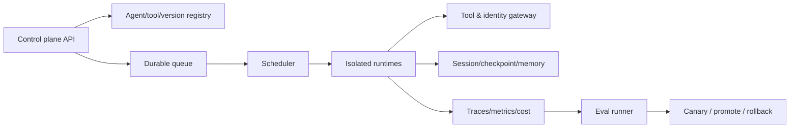

# 项目与作品集

作品集的目标不是展示“调用了哪些 API”，而是让面试官看到你能定义问题、构建系统、评测、上线、处理故障并做技术判断。

## 通用 Definition of Done

每个公开主项目至少包含：

- 英文 README：problem、users、architecture、quickstart、metrics、limitations
- pinned dependencies、sample env、无真实 secret
- unit/integration/e2e tests
- eval dataset、grader、baseline、实验结果和失败分类
- tracing/metrics 示例和一条完整 trajectory
- threat model、approval boundary、data handling
- 架构图与至少 1 个 ADR
- 3–8 分钟 demo；capstone 为 8–12 分钟
- issue backlog、release tag、changelog
- 一次真实或演练故障的 postmortem

严禁：伪造用户数、成本、benchmark 或生产影响。

## P0 — Raw Agent Loop Lab

位置：`projects/p0_raw_agent_loop/`

### 目的

证明你理解 Agent 的原语，而不是只会框架。

### 必做功能

- provider-neutral model interface
- JSON Schema / typed tool registry
- loop state machine 和显式终止原因
- tool result validation、timeout、retry 和 error taxonomy
- step/token/time/cost budget
- side-effect tools 的 idempotency key
- human approval hook
- checkpoint/resume
- JSONL trace

### Eval

- 20 个正常任务
- 10 个工具失败/timeout/无效输出任务
- 10 个安全/权限负向任务
- 报告 success、unsafe action、p95 latency、cost/task、mean steps

### 面试信号

能解释 framework 在替你做什么，以及什么情况下需要绕过或扩展它。

## P1 — Evidence-First Research Agent

位置：`projects/p1_evidence_research_agent/`

### 目的

展示 production RAG、context engineering、引用和 eval，而不是“PDF 聊天机器人”。

### 用户故事

用户上传一组版本化文档，Agent 必须回答、逐条引用、说明证据冲突，并在证据不足时拒答。它可把复杂问题拆成检索子任务，但最终结论必须有可点击证据。

### 必做功能

- incremental ingestion、parser、chunk lineage、dedupe、delete
- BM25 + dense hybrid retrieval + reranker
- query rewrite/multi-hop；每一步保留 trace
- citation span validation
- 文档权限和 tenant filter 在检索层强制执行
- conversation state 与显式 memory policy
- streaming API + 简单 Web UI

### Eval

- 50–100 queries，包含 answerable、unanswerable、conflicting、temporal、permission cases
- retrieval：Recall@k、MRR 或 nDCG
- answer：claim support、citation precision/recall、abstention precision
- operations：latency、tokens、cost
- baseline：keyword-only、dense-only、无 rerank 至少三组

### 可选领域

- 金融政策/年报：偏 JPM
- 云和 Agent 官方文档：偏 AWS/Google/Microsoft
- CUDA/NVIDIA 文档：偏 NVIDIA

## P2 — Secure MCP Tool Gateway

位置：`projects/p2_secure_mcp_gateway/`

### 目的

展示协议、identity、安全和治理能力。

### 必做功能

- 兼容当前 MCP 规范的 server 与 test client
- 至少 5 个工具：read、search、write-draft、external side effect、long-running task
- OAuth/scoped identity 或等价 mock
- policy enforcement point：tenant、tool、resource、argument-level authorization
- approval UI/API：展示动作、参数、影响和证据
- audit log、rate limit、timeout、circuit breaker
- untrusted tool description/result 的隔离与标记
- Tasks/长任务状态或等价 durable job

### Security eval

- prompt/indirect injection
- tool poisoning / description injection
- confused deputy
- privilege escalation
- cross-tenant access
- secret exfiltration
- replay / duplicate side effects
- SSRF/path traversal 类输入验证

报告 attack success rate 与正常任务成功率，说明残余风险。

## P3 — Agent Evaluation Lab

位置：`projects/p3_agent_eval_lab/`

### 目的

把 eval 作为独立的工程产品，而不是 notebook 尾部几个示例。

### 必做功能

- task schema、dataset version、trial isolation
- 并发 runner、seed/config capture、trace storage
- code-based、model-based、human review 三类 grader
- outcome 与 trajectory 分开评分
- repeated trials、pass@k / pass^k 或 bootstrap CI
- regression/capability/safety 三个 suite
- experiment comparison dashboard/report
- transcript viewer 或可读 HTML/Markdown 报告

### 核心实验

在同一套 50+ tasks 上比较：

1. 两个模型或两个规格；
2. raw loop 与一个框架；
3. 单 Agent 与 multi-agent；
4. 不同 tool description 或 context strategy。

结论可以是“更复杂的方案没有提升”。负结果只要实验严谨，同样有价值。

## P4 — Multi-Tenant Agent Harness Platform（核心 Capstone）

位置：`projects/p4_agent_harness_platform/`

### 目的

构建一个最小但可信的“AgentCore-like”平台，直接对应 Agent Platform/Harness Engineer 岗位。

### Architecture minimum

### 必做功能

#### Control plane

- agent config、tool、skill、model policy、version、endpoint registry
- immutable version + named deployment
- canary、promotion、rollback
- per-tenant quota、budget 和 RBAC

#### Data plane

- sync streaming 和 async long-running invoke
- session state、checkpoint、resume、cancel
- sandbox/isolated worker（可用容器模拟）
- tool gateway、scoped credentials、approval
- timeout、retry、idempotency、dead-letter

#### Quality and operations

- OpenTelemetry trace + metrics + cost attribution
- offline eval 与 shadow/canary comparison
- load test、SLO、capacity estimate
- failure injection：worker death、tool timeout、provider 429、DB failover 场景

### 最低指标

指标阈值根据本地/云资源制定，但必须包含：

- task success rate
- unsafe action rate = 0 on regression suite
- p50/p95 end-to-end latency
- recovery success after injected worker death
- duplicate side-effect rate = 0
- cost per successful task
- tenant isolation negative tests = 100% blocked

### 范围控制

不需要复制完整云产品。优先把 3 个关键路径做深：可靠执行、权限隔离、eval 驱动发布。UI 只需支持运维和 demo。

## P5 — Domain Capstone 分支

在 P4 上构建一个真实垂直应用，二选一。

### 分支 A：Auditable Financial Operations Agent

- 读取政策、账户/交易 mock 数据和市场数据
- 生成带证据的分析，不执行真实交易
- 规则引擎 + LLM：硬规则不可被模型覆盖
- maker-checker 双人审批模拟
- PII/tokenization、retention、audit trail
- 处理冲突、缺失、过期数据；输出 uncertainty
- 评测 suitability、policy compliance、citation、explanation 和拒绝行为

适配：JPM、金融科技、风控/合规 AI。

### 分支 B：Repository Maintenance Agent

- 从 issue 到 branch/patch/test/report 的长时 workflow
- repo map、incremental context、artifact handoff
- sandbox、网络和 secret 权限
- planner/generator/evaluator，但用 eval 验证每个角色是否必要
- 代码测试、静态分析、浏览器 e2e、diff risk score
- 不自动 merge；高风险变更必须人审

适配：Microsoft、AWS、Google、xAI、Developer Productivity。

### 分支 C：GPU-Aware Inference Optimization Agent

- 收集 profiler 结果并提出/执行受限优化实验
- 比较模型、batch、quantization、cache、routing
- 生成可复现实验和统计报告
- 对 CUDA/配置改动做 sandbox、test 和 rollback
- 以质量门槛约束性能优化

适配：NVIDIA、ML Systems、Inference Platform。

## 作品集组合

### 最低可投递组合

- P0：证明原理
- P1 或 P2：证明应用/安全纵深
- P3：证明 eval 能力
- P4 + 一个 P5 分支：证明系统和领域影响

### GitHub 首页排序

1. P4/P5 capstone
2. P3 eval lab
3. P1 或 P2
4. 1–3 个高质量开源 PR

P0 可以作为教学型 repo，不必占首页黄金位置。

## 每个项目的面试叙事

用六句话回答：

1. 用户是谁，原来为什么失败？
2. 你定义了什么可测 success 和 non-goal？
3. 最关键的架构取舍是什么？
4. 哪个失败最出乎意料，如何从 trace 找到根因？
5. 数据显示哪项改动有效/无效？
6. 如果有 10 倍流量、严格合规或三个月时间，会如何演进？
