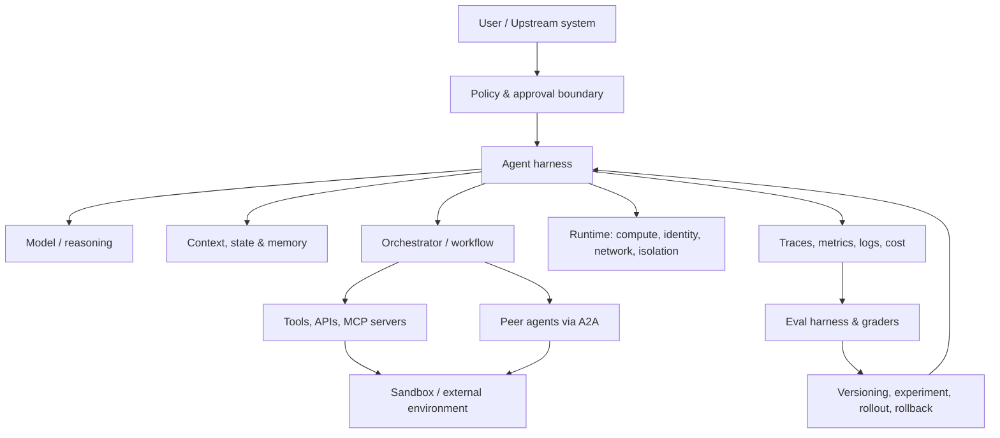

# Agent / Harness 概念地图

## 1. 一张图

核心思想：**Agent 的行为不是模型单独决定的，而是 model × instructions × tools × data × harness × environment 的共同产物。**

## 2. 必须能清楚区分的术语

### Model

把输入映射为输出的概率模型。它可以推理、生成结构化数据或发起工具调用，但自身通常不拥有业务权限、持久状态或真实执行环境。

### Workflow

开发者预先定义控制流：步骤、分支、并行、重试和终止条件大体确定。适合规则明确、风险高、需要审计的任务。

### Agent

模型在循环中根据当前状态决定下一步行动，可能调用工具、观察结果、更新计划，直到完成或达到停止条件。Agent 的控制流至少部分由模型动态决定。

### Agent loop

最小循环：构造上下文 → 调模型 → 校验输出 → 执行工具 → 写回结果 → 检查预算/终止条件。它是 harness 的核心，但不等于完整 harness。

### Agent harness / scaffold

让模型真正“作为 Agent 运行”的系统。通常包括：

- orchestration loop 和工具路由
- instructions、skills、context 构造与 compaction
- session state、短期/长期 memory、checkpoint
- tool contract、permission、identity、approval
- sandbox、filesystem、network 和隔离
- timeout、retry、idempotency、budget、failure recovery
- tracing、metrics、cost、versioning、deployment 和 rollback

AWS 的定义很实用：模型调用循环，加上 compute、sandbox、安全工具连接、filesystem、memory、identity 和 observability，整体构成 harness。

### Runtime

承载 Agent 代码或 harness 的执行基础设施，负责 compute、session、network、auth、scaling 和 isolation。Runtime 可以不提供 orchestration loop；harness 则必须关心 Agent 如何行动。

### Sandbox

受限执行环境。控制文件、进程、网络、凭证、CPU/GPU、内存和生命周期，降低恶意或错误工具调用的影响半径。

### Tool / function calling

模型输出结构化调用意图，应用校验后执行真实函数/API。工具描述是 API contract，不是宣传文案；需明确 schema、返回值、错误、权限和副作用。

### Skill

可复用的领域指令、流程、脚本和资源集合。它教 Agent “如何完成某类任务”；tool 则提供“能执行什么动作”。

### MCP

Model Context Protocol，标准化客户端如何发现和使用外部 tools、resources、prompts 等能力。它主要解决 **Agent ↔ 工具/上下文提供方** 的互操作。

### A2A

Agent2Agent Protocol，标准化独立 Agent 之间的能力发现、消息、任务状态和协作。它主要解决 **Agent ↔ Agent**，不能替代 MCP。

### Prompt engineering

设计一条或一组指令，使模型在给定上下文中更可靠地产生目标输出。它是 context engineering 的一个子集。

### Context engineering

在每一步选择并组织 instructions、历史、检索结果、memory、tool schema、环境反馈和预算，使有限 context window 包含最高价值信息。

### RAG

Retrieval-Augmented Generation：在推理时从外部语料检索证据再生成。完整 RAG 包括 ingestion、chunking、index、query transformation、retrieval、reranking、context assembly、citation 和 evaluation。

### Memory

- working memory：当前上下文中的临时信息
- episodic memory：过去事件、任务和轨迹
- semantic memory：抽取后的事实/偏好/知识
- procedural memory：技能、规则和做事方式

数据库里存了聊天记录不等于有了有效 memory；必须定义写入、读取、遗忘、冲突和隐私策略。

### Orchestration

协调步骤、模型、工具和 Agent。模式包括 router、planner-executor、supervisor-worker、map-reduce、generator-evaluator、event-driven workflow。

### Multi-agent system

多个相对独立的 Agent 通过 handoff、共享状态或协议协作。只有当任务可并行、需要权限/上下文隔离、专长明显不同或独立评审有数据收益时使用。

### Trace / trajectory / transcript

一次 trial 的完整过程：模型输出、工具调用、中间状态、错误和结果。Debug Agent 时，trace 相当于分布式系统的调用链加决策记录。

### Outcome

Agent 运行后外部世界的最终状态。Agent 说“机票已预订”是文本；数据库中确有预订才是 outcome。

### Eval

给系统一个任务并用 grader 测量成功。Agent eval 通常同时检查：

- outcome：最终结果是否正确
- trajectory：过程是否安全、合理、合规
- quality：事实、完整性、表达或领域标准
- operations：延迟、成本、token、工具次数、错误率

### Eval harness

批量运行任务、隔离环境、收集 trace、调用 grader、聚合结果的基础设施。它不同于让 Agent 执行任务的 agent harness。

### Grader

- code-based：测试、schema、SQL 状态、静态分析
- model-based：rubric + LLM judge
- human：专家或用户评审

优先确定性 grader；使用 LLM judge 时要做人类校准、防 bias 和防 reward hacking。

### Guardrail

在输入、计划、工具调用、输出或 outcome 上执行的约束/检测。Guardrail 不能替代真正的 auth、sandbox、least privilege 和数据治理。

### Human-in-the-loop

人在关键决策点审批、纠偏或接管。审批对象应是具体 action、参数、影响和证据，而不是模糊地问“是否继续”。

### Fine-tuning / post-training

改变模型参数以学习行为或领域能力。先确认问题不是检索、工具、上下文、grader 或产品规格导致；有高质量数据和稳定 eval 后再考虑。

### Inference / serving

模型实际运行并生成 token 的系统。关键维度有 TTFT、tokens/sec、throughput、batching、KV cache、quantization、GPU memory、availability 和 cost。

## 3. Workflow 还是 Agent

| 情况 | 优先选择 |
|---|---|
| 步骤固定、监管严格、出错成本高 | 确定性 workflow |
| 输入变化大、需要动态选择工具 | 单 Agent + 严格边界 |
| 可并行搜索多个独立空间 | parallel workers |
| 需要不同权限或上下文隔离 | 多 Agent / 多 runtime |
| 需要独立质量评审 | generator + evaluator |
| 只是顺序调用三个 API | 普通代码，不必 Agent 化 |

## 4. 常见误区

- “用了 LLM”不等于“做了 Agent”。
- “有向量库”不等于“RAG 可靠”。
- “有 system prompt”不等于“权限安全”。
- “多 Agent”不天然比单 Agent强。
- “LLM judge 给高分”不等于用户 outcome 成功。
- “模型升级”不保证系统升级；必须在自己的 eval suite 上验证。
- “上下文更长”不等于 context engineering 可以省略。
